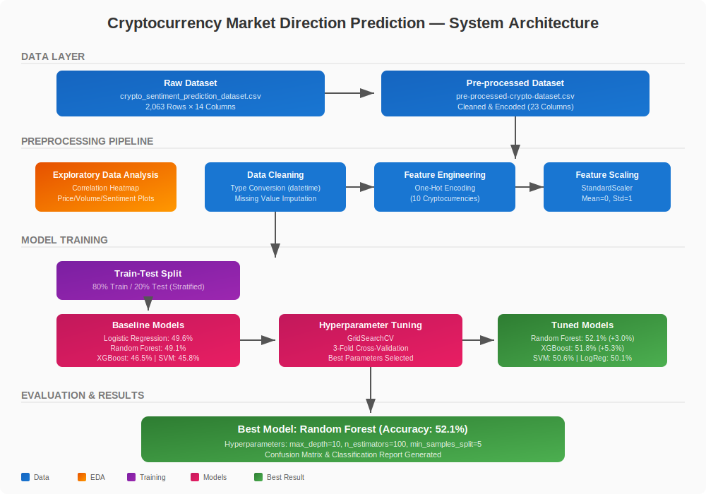
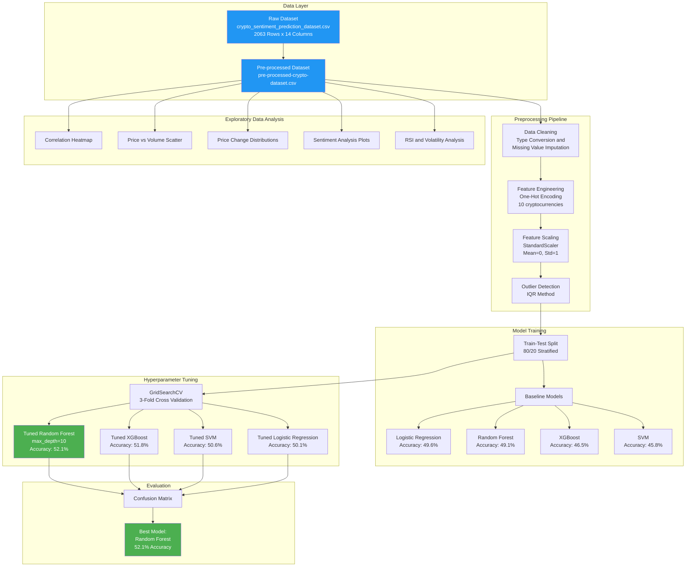

# Cryptocurrency Market Direction Prediction using Sentiment Analysis


## Abstract

This project investigates the efficacy of **Sentiment Analysis** and **Machine Learning** in predicting the short-term (24-hour) price direction of major cryptocurrencies. Challenging the Efficient Market Hypothesis (EMH), this study explores whether social media sentiment, news scores, and technical indicators contain predictive signals that can be exploited by non-linear algorithms.

Completed as part of the **CMP5367: Artificial Intelligence and Machine Learning** module at **Birmingham City University**.

**Team Members:**
- Amogh Dath Kalasapura Arunkumar — Model Training and Evaluation
- Rajveer Singh Saini — Exploratory Data Analysis
- Harshpreet Singh — Dataset Pre-processing
- Jaspreet Kaur — Dataset Overview

---

## System Architecture

### Architecture Diagram


### Data Flow (Mermaid)


---

## Dataset

The project utilizes the **Crypto Market Sentiment and Price Dataset (2025)** sourced from Kaggle.

| Attribute | Detail |
|-----------|--------|
| **Source** | [Kaggle Dataset](https://www.kaggle.com/datasets/pratyushpuri/crypto-market-sentiment-and-price-dataset-2025) |
| **Observations** | 2,063 data points |
| **Features** | 14 columns (11 numerical, 1 integer, 2 categorical) |
| **Target** | Binary Classification (1 = Bullish/Up, 0 = Bearish/Down) |
| **Missing Values** | None (fully clean) |
| **Duplicates** | None |

### Feature Descriptions

| Column | Description | Data Type |
|--------|-------------|-----------|
| `timestamp` | Date/time of the record | object |
| `cryptocurrency` | Name of the cryptocurrency (10 unique coins) | object |
| `current_price_usd` | Current market price in USD | float64 |
| `price_change_24h_percent` | % price change in the last 24h | float64 |
| `trading_volume_24h` | Total trading volume in the last 24h | float64 |
| `market_cap_usd` | Market capitalization in USD | float64 |
| `social_sentiment_score` | Sentiment score from social media | float64 |
| `news_sentiment_score` | Sentiment from news sources | float64 |
| `news_impact_score` | Strength/impact of news events | float64 |
| `social_mentions_count` | Number of social media mentions | int64 |
| `fear_greed_index` | Market emotion indicator (0–100) | float64 |
| `volatility_index` | Market volatility measure | float64 |
| `rsi_technical_indicator` | Relative Strength Index value | float64 |
| `prediction_confidence` | Confidence score of prediction | float64 |

### Cryptocurrencies Covered

Bitcoin, Ethereum, Solana, Cardano, Polkadot, Avalanche, Chainlink, Polygon, Algorand, Cosmos

---

## Methodology

### 1. Data Pre-processing
- **Target Engineering:** Converted continuous `price_change_24h_percent` into a binary target (bullish if > 0%)
- **Cleaning:** Verified data integrity — zero missing values and zero duplicates
- **Type Conversion:** `timestamp` converted from object to datetime64
- **Imputation:** Numerical columns imputed with median; categorical with most frequent
- **Encoding:** One-Hot Encoding for `cryptocurrency` (10 binary coin columns)
- **Scaling:** StandardScaler applied to all numerical features (mean=0, std=1)
- **Outlier Detection:** IQR method applied (outliers retained as they represent real market events)

### 2. Feature Engineering
- Target: `price_change_24h_percent > 0` → 1 (Bullish), else 0 (Bearish)
- Features dropped: `timestamp`, `price_change_24h_percent`, `prediction_confidence`
- Preprocessing pipeline using `ColumnTransformer` with `StandardScaler` for numeric and `OneHotEncoder` for categorical features

### 3. Models Evaluated
Four distinct algorithm families were tested:

| Model | Type | Baseline Accuracy | Tuned Accuracy | Improvement |
|-------|------|------------------|----------------|-------------|
| **Random Forest** | Bagging Ensemble | 49.1% | **52.1%** | **+3.0%** |
| **XGBoost (Gradient Boosting)** | Boosting Ensemble | 46.5% | **51.8%** | +5.3% |
| **SVM (RBF Kernel)** | Kernel-based | 45.8% | **50.6%** | +4.8% |
| **Logistic Regression** | Linear Baseline | 49.6% | **50.1%** | +0.5% |

### 4. Hyperparameter Optimization
- **Method:** GridSearchCV with 3-Fold Cross-Validation
- **Best Random Forest Params:** `max_depth=10`, `n_estimators=100`, `min_samples_split=5`
- **Best XGBoost Params:** `learning_rate=0.01`, `max_depth=3`, `n_estimators=50`
- **Best SVM Params:** `C=10`, `kernel='rbf'`, `gamma='auto'`

---

## Results

### Key Findings

1. **Random Forest** achieved the highest stability and accuracy (52.1%), suggesting that regularization is key when modeling high-noise financial data
2. Sentiment features show **very low linear correlation** with price direction (< 0.02)
3. Non-linear ensemble methods (Random Forest, XGBoost) consistently outperformed linear models
4. Hyperparameter tuning improved ensemble models by 3-5%, while linear models saw minimal gains
5. The marginal edge over random guessing (50%) confirms the **challenge of market prediction** using sentiment alone

### Visualizations

The `images/` directory contains 12 generated plots:
- `CorrelationHeatmap.png` — Feature correlation matrix
- `Scatterplot_Cryptocurrency_Price_VS_Trading_vol.png` — Price vs Volume (log-log)
- `Violonplot_overlay_on_Boxplot.png` — Price change distribution by coin
- `Violonplot_with_swarm_overlay.png` — Sentiment distributions
- `Jointplot_Scatterplot_regplot_histplot.png` — Sentiment relationship analysis
- `Histogram_RSI_Indicator.png` — RSI distribution
- `3D_Scatterplotting.png` — 3D sentiment visualization
- `Barh.png` — Horizontal bar charts
- `Outliers.png` / `Handled_outliers.png` — Outlier analysis
- `Hexbin_plot.png` — Hexbin density plot
- `ConfusionMatrix_Random_Forest.png` — Best model confusion matrix

---

## Repository Structure

```
AI-ML-Model-For-CryptoAnalysis/
├── Academic_Report/                    # Final academic report (PDF) and peer assessment
│   ├── Crypto_Trend_Analysis_Report.pdf
│   └── peer-assessment.xlsx
├── dataset/                            # Dataset files
│   ├── crypto_sentiment_prediction_dataset.csv   # Raw dataset (2063 x 14)
│   ├── dataset_overview.md                       # Detailed dataset documentation
│   └── pre-processed-crypto-dataset.csv          # Preprocessed dataset
├── Final_Notebook/                     # Merged final notebook (all team contributions)
│   ├── Crypto_Trend_Analysis_Final.ipynb         # Complete analysis pipeline
│   └── Final_notebook_info.md                    # Notebook documentation
├── images/                             # 12 generated visualization plots
│   ├── CorrelationHeatmap.png
│   ├── Scatterplot_Cryptocurrency_Price_VS_Trading_vol.png
│   ├── ConfusionMatrix_Random_Forest.png
│   └── ... (9 more)
├── Project-Brief/                      # Assessment brief and sample reports (PDFs)
├── src_notebooks/                      # Individual team member notebooks
│   ├── data_set_overview.ipynb                    # Jaspreet Kaur
│   ├── data_set_exploration(EDA).ipynb            # Rajveer Singh Saini
│   ├── data_set_preprocessing.ipynb               # Harshpreet Singh
│   └── model_training_&_Evaluation.ipynb          # Amogh Dath Kalasapura Arunkumar
├── requirements.txt                    # Python dependencies
└── README.md                           # This file
```

---

## Installation & Usage

### Prerequisites
- Python 3.8+
- Pip

### Setup
```bash
# Clone the repository
git clone https://github.com/Amogh-007-Rin/AI-ML-Model-For-CryptoAnalysis
cd AI-ML-Model-For-CryptoAnalysis

# Install dependencies
pip install -r requirements.txt
```

### Run the Analysis
```bash
# Launch Jupyter and open the final notebook
jupyter notebook Final_Notebook/Crypto_Trend_Analysis_Final.ipynb
```

Or explore individual notebooks:
```bash
jupyter notebook src_notebooks/data_set_overview.ipynb
jupyter notebook src_notebooks/data_set_exploration\(EDA\).ipynb
jupyter notebook src_notebooks/data_set_preprocessing.ipynb
jupyter notebook src_notebooks/model_training_\&_Evaluation.ipynb
```

---

## Dependencies

```
pandas
numpy
seaborn
matplotlib
scikit-learn
scipy
```

---

## Conclusions & Future Work

### Conclusions
- Sentiment analysis provides a **marginal but real** predictive signal for crypto price direction
- Non-linear ensemble models (Random Forest, XGBoost) are better suited than linear models for the high-noise crypto domain
- Random Forest with `max_depth=10` achieved the best balance of bias and variance
- The Efficient Market Hypothesis is partially challenged — markets are not perfectly efficient with respect to sentiment data

### Future Directions
1. **Time Series Analysis:** Implement LSTM/GRU models to capture temporal dependencies
2. **Deep Learning:** Explore transformer-based models for sequence prediction
3. **Cross-Market Analysis:** Extend to correlations across different cryptocurrency markets
4. **Real-Time Prediction:** Develop a live prediction system with streaming data
5. **Alternative Data Sources:** Incorporate on-chain metrics, developer activity, and regulatory news

---

## License

This project is licensed under the MIT License.

## Acknowledgements

- **Birmingham City University** — CMP5367: AI and Machine Learning module
- **Kaggle** — Crypto Market Sentiment and Price Dataset by Pratyush Puri
